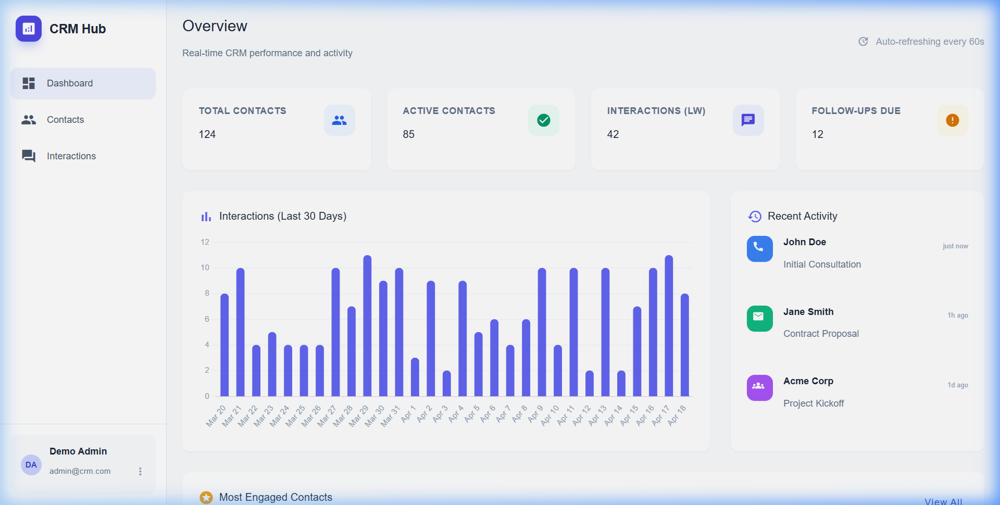
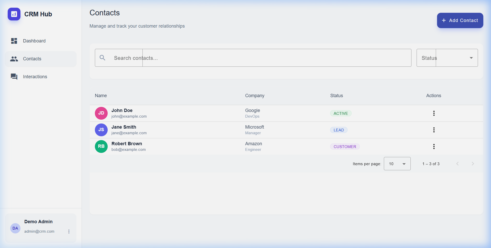
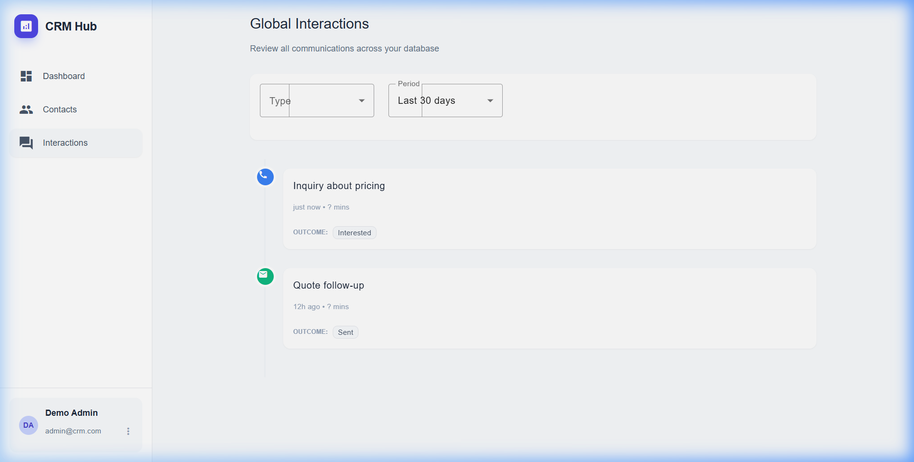
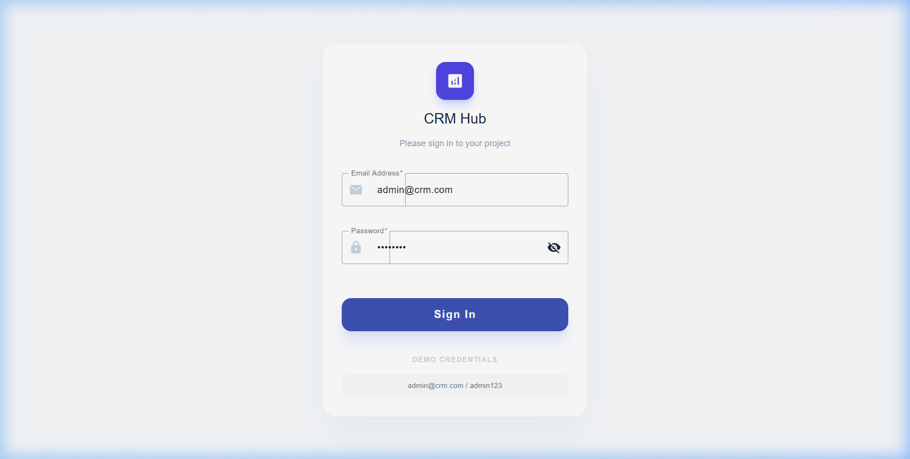
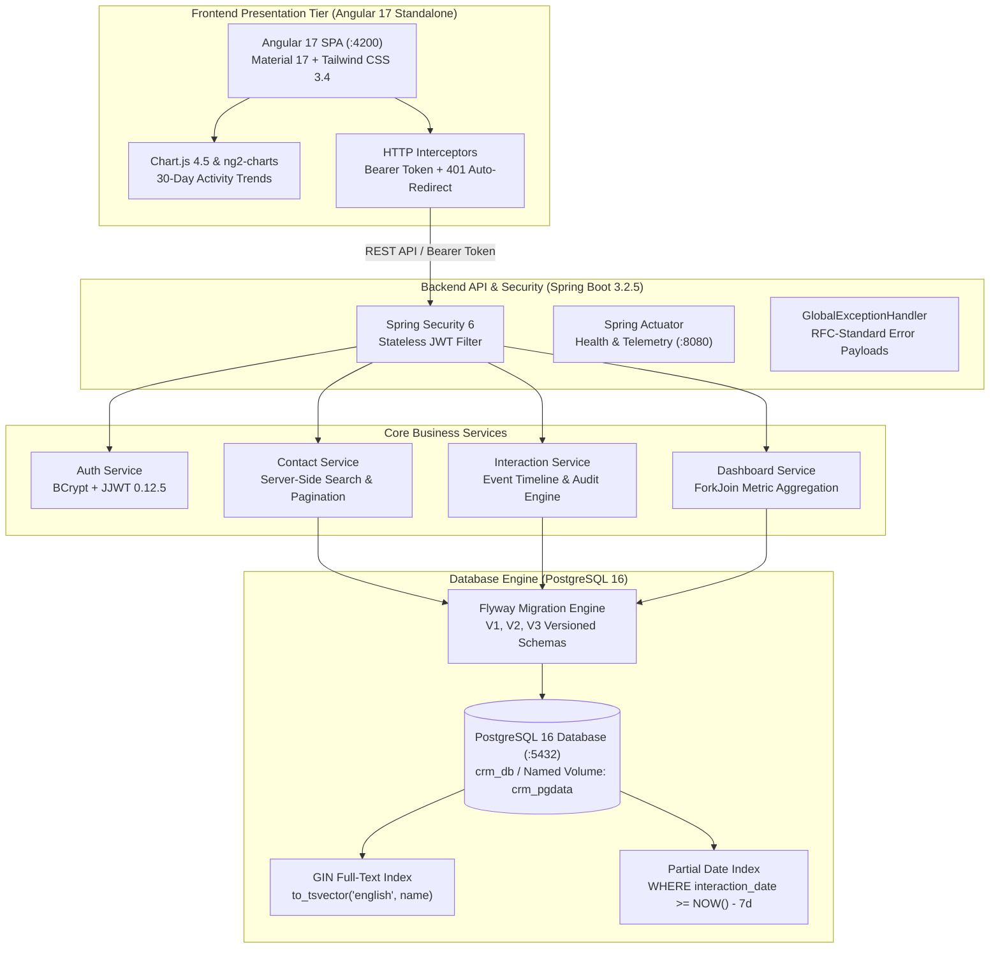

<div align="center">

# CRM Hub — Enterprise Relationship & Interaction Management Platform

**Modern Full-Stack CRM with Spring Boot 3.2, Angular 17 Standalone, PostgreSQL 16, and Real-Time Analytics**

<p align="center">
  <a href="https://adoptium.net/"></a>
  <a href="https://spring.io/projects/spring-boot"></a>
  <a href="https://angular.dev/"></a>
  <a href="https://tailwindcss.com/"></a>
  <a href="https://www.chartjs.org/"></a>
  <a href="https://www.postgresql.org/"></a>
  <a href="LICENSE"></a>
  <a href="#quickstart"></a>
</p>

<p align="center">
  Enterprise contact intelligence, full-lifecycle interaction tracking, and executive activity analytics.<br>
  Spring Boot 3.2 · Angular 17 Standalone Architecture · GIN Full-Text Indexing · Docker PostgreSQL.
</p>

<p align="center">
  <a href="#quick-flow">Quick Flow</a> •
  <a href="#visual-showcase">Visual Showcase</a> •
  <a href="#system-architecture">Architecture</a> •
  <a href="#core-architectural-modules">Core Modules</a> •
  <a href="#quickstart">Quickstart</a> •
  <a href="#api-reference">API Reference</a>
</p>

</div>

---

## Quick Flow

```
docker compose up  →  Seed Auth  →  Contact Directory  →  Interaction Timeline  →  Executive Dashboard
```

---

## Visual Showcase

### Executive Intelligence Dashboard
Real-time KPI telemetry, 30-day interaction trend visualization via Chart.js, recent interaction feed, and highest-engagement account rankings.

<div align="center">
  
</div>

<br/>

### Contact Directory & Search Engine
Debounced server-side full-text search, multi-tier status lifecycle chips (Active, Lead, Customer, Inactive), and paginated data table.

<div align="center">
  
</div>

<br/>

### Chronological Interaction Timeline
Multi-channel event logging across calls, emails, meetings, and notes with duration calculations and outcome tracking.

<div align="center">
  
</div>

<br/>

### Authentication & Access Control
Stateless JWT-secured login interface with form validation, BCrypt credential verification, and automated token injection.

<div align="center">
  
</div>

---

## System Architecture



---

## Core Architectural Modules

### 01. High-Performance Contact Directory & GIN Text Indexing
* **Database Full-Text Indexing**: PostgreSQL `GIN` index (`idx_contacts_name`) built over `to_tsvector('english', name)` for sub-millisecond prefix and pattern matching across large lead databases.
* **Debounced Client Search**: Angular Reactive Forms search control with 300ms debounce buffer prevents unnecessary server queries during keystroke entry.
* **Lifecycle State Machine**: Strict schema-level status constraints (`ACTIVE`, `INACTIVE`, `LEAD`, `CUSTOMER`) with color-coded Angular Material chips.
* **Spring Data Pagination**: Efficient zero-indexed `Pageable` database slices prevent memory bloat on large result sets.

### 02. Chronological Interaction Timeline & Partial Indexing
* **Polymorphic Interaction Channels**: Dedicated support for 4 core communication channels: `CALL`, `EMAIL`, `MEETING`, and `NOTE`.
* **Database Partial Indexing**: Targeted PostgreSQL index (`idx_interactions_date_week`) restricted to records within `NOW() - INTERVAL '7 days'` for lightning-fast weekly KPI reporting.
* **Cascading Relationship Management**: JPA `@ManyToOne` lazy-loaded mapping with foreign key `ON DELETE CASCADE` ensures referential integrity when accounts are deleted.
* **Audit Metadata**: Tracks interaction duration in minutes, structured outcomes, timestamps, and freeform markdown descriptions.

### 03. Executive Analytics & 60-Second Reactive Polling
* **Composite KPI Telemetry**: Instant summary cards displaying Total Contacts, Active Accounts, Weekly Interaction Volume, and critical Follow-ups Due (leads with zero activity for over 7 days).
* **Parallel Endpoint Aggregation**: Angular `forkJoin` coordinates simultaneous calls to summary, timeline chart, recent activity, and top contact endpoints into a single atomic render pass.
* **Dynamic Time-Series Visualization**: Integrated Chart.js 4.5 bar chart rendering 30-day activity trends with date and count tooltips.
* **Automated Background Refresh**: RxJS `timer(0, 60000)` with `switchMap` provides real-time dashboard updates without full page reloads.

### 04. Enterprise Security & Stateless JWT Architecture
* **Stateless Session Management**: Built on Spring Security 6 with `SessionCreationPolicy.STATELESS` and JJWT 0.12.5 token generation.
* **Password Hashing**: BCrypt adaptive hashing with salt rounds ensures secure credential storage in the `users` table.
* **Automated Request Authentication**: Custom Angular `AuthInterceptor` attaches `Authorization: Bearer <token>` to all outbound requests and handles automated session expiry redirects.
* **Pre-Seeded Administrative Profile**: Flyway migration automatically seeds a default administrator account for immediate local onboarding.

---

## Tech Stack

### Backend & Infrastructure
| Technology | Version | Purpose |
| :--- | :--- | :--- |
| **Java** | 17 LTS | High-performance enterprise runtime |
| **Spring Boot** | 3.2.5 | Modern microservice framework |
| **Spring Security** | 6.x | Stateless JWT authentication & endpoint authorization |
| **Spring Data JPA** | 3.x | Object-Relational Mapping & repository layer |
| **PostgreSQL** | 16 | Relational database with full-text GIN and partial indexing |
| **Flyway** | 10.x | Automated versioned database migrations |
| **JJWT** | 0.12.5 | JSON Web Token parsing, validation, and signing |
| **MapStruct** | 1.5.5 | Type-safe compile-time DTO-entity object mapping |
| **Lombok** | 1.18.x | Boilerplate code reduction |
| **Docker Compose** | 3.8 | PostgreSQL container orchestration |

### Frontend & UI
| Technology | Version | Purpose |
| :--- | :--- | :--- |
| **Angular** | 17.3 | Standalone component Single Page Application |
| **Angular Material** | 17.0 | Enterprise UI components (Data Tables, Dialogs, Chips) |
| **Tailwind CSS** | 3.4.19 | Utility-first responsive design system |
| **Chart.js** | 4.5.1 | Canvas-based data visualization engine |
| **ng2-charts** | 10.0.0 | Angular integration layer for Chart.js |
| **TypeScript** | 5.4.2 | Strongly-typed client application logic |
| **RxJS** | 7.8 | Reactive streams and polling orchestration |

---

## Quickstart

### Prerequisites
* **Java 17+** (JDK)
* **Node.js 18+** & npm
* **Docker & Docker Compose**

---

### Step 1: Start PostgreSQL Database
Spin up the PostgreSQL 16 container with persistent volume storage:
```bash
docker compose up -d
```
*Port: `localhost:5432` | Database: `crm_db` | User: `crm_user` | Password: `crm_pass`*

---

### Step 2: Start Spring Boot Backend
Navigate to the backend directory and launch the application:
```bash
cd crm-backend
mvn clean spring-boot:run
```
*The backend starts at `http://localhost:8080`. Flyway automatically applies migrations V1 through V3 on boot.*

---

### Step 3: Start Angular Frontend
In a new terminal window, navigate to the frontend directory, install dependencies, and serve the application:
```bash
cd crm-frontend
npm install
npm start
```
*The Angular development server starts at `http://localhost:4200`.*

---

### Default Credentials
Flyway automatically provisions a pre-configured administrator account:

| Field | Value |
| :--- | :--- |
| **Email** | `admin@crm.com` |
| **Password** | `admin123` |

---

## API Reference

### Authentication Endpoints
| Method | Endpoint | Description | Access |
| :--- | :--- | :--- | :---: |
| `POST` | `/api/auth/login` | Authenticate user credentials and return JWT bearer token | Public |
| `POST` | `/api/auth/register` | Register new account | Public |

### Contact Management
| Method | Endpoint | Description | Access |
| :--- | :--- | :--- | :---: |
| `GET` | `/api/contacts?page=0&size=20&search=&status=` | Paginated contact search with status filters | Bearer Token |
| `GET` | `/api/contacts/{id}` | Retrieve contact by UUID | Bearer Token |
| `POST` | `/api/contacts` | Create new contact profile | Bearer Token |
| `PUT` | `/api/contacts/{id}` | Update existing contact details | Bearer Token |
| `DELETE` | `/api/contacts/{id}` | Remove contact and cascade delete interactions | Bearer Token |

### Interaction Timeline
| Method | Endpoint | Description | Access |
| :--- | :--- | :--- | :---: |
| `GET` | `/api/interactions?contactId=&days=30` | Retrieve interaction feed with optional contact filter | Bearer Token |
| `GET` | `/api/interactions/{id}` | Retrieve interaction details | Bearer Token |
| `POST` | `/api/interactions` | Record new interaction event | Bearer Token |
| `PUT` | `/api/interactions/{id}` | Update interaction details | Bearer Token |
| `DELETE` | `/api/interactions/{id}` | Delete interaction record | Bearer Token |

### Executive Dashboard & Telemetry
| Method | Endpoint | Description | Access |
| :--- | :--- | :--- | :---: |
| `GET` | `/api/dashboard/summary` | Retrieve KPI card metrics (total, active, weekly, due) | Bearer Token |
| `GET` | `/api/dashboard/interactions-chart?days=30` | 30-day chronological interaction counts for Chart.js | Bearer Token |
| `GET` | `/api/dashboard/recent-interactions?limit=5` | Most recent interactions across all accounts | Bearer Token |
| `GET` | `/api/dashboard/top-contacts?limit=5` | Top 5 contacts ranked by interaction frequency | Bearer Token |
| `GET` | `/actuator/health` | Service health status and readiness check | Public |

---

## Repository Structure

```
CRMApp/
├── docker-compose.yml                     # PostgreSQL 16 container definition
├── images/                                # High-resolution application screenshots
│   ├── dashboard.png                      # Executive dashboard & metrics view
│   ├── contacts.png                       # Contact directory & filter interface
│   ├── interactions.png                   # Chronological interaction timeline
│   └── login.png                          # Stateless authentication view
├── crm-backend/                           # Spring Boot 3.2.5 REST API
│   ├── src/main/java/com/crm/
│   │   ├── auth/                          # JWT authentication, user model, & controller
│   │   ├── config/                        # SecurityConfig, CorsConfig, & password encoding
│   │   ├── contact/                       # Contact entities, DTOs, mappers, & repository
│   │   ├── dashboard/                     # Executive metric calculations & analytics
│   │   ├── exception/                     # GlobalExceptionHandler & error contracts
│   │   └── interaction/                   # Interaction event logging & timeline services
│   ├── src/main/resources/
│   │   ├── db/migration/                  # Flyway migrations (V1, V2, V3)
│   │   └── application.yml                # Connection pool, JWT, & logging configuration
│   └── pom.xml                            # Maven dependencies & build plugins
└── crm-frontend/                          # Angular 17 Standalone SPA
    ├── src/app/
    │   ├── core/                          # Guards, HTTP interceptors, models, & services
    │   ├── features/                      # Auth, Contacts, Dashboard, & Interactions views
    │   └── shared/                        # Sidebar navigation, dialogs, & time-ago pipe
    ├── src/styles.scss                    # Design system tokens & typography
    ├── tailwind.config.js                 # Tailwind CSS theme configuration
    └── package.json                       # Angular & UI dependency declarations
```

---

## Contributing

1. Fork the repository.
2. Clone your fork:
   ```bash
   git clone https://github.com/tanmayythakare/CRMApp.git
   ```
3. Create your feature branch:
   ```bash
   git checkout -b feat/your-feature-name
   ```
4. Commit your changes:
   ```bash
   git commit -m "feat: add descriptive feature summary"
   ```
5. Push to your branch and submit a Pull Request.

---

## License

This project is open-source and distributed under the **[MIT License](LICENSE)**.

---

## Author

**Tanmay Thakare**
* GitHub: [@tanmayythakare](https://github.com/tanmayythakare)
* Email: [tanmayrthakare@gmail.com](mailto:tanmayrthakare@gmail.com)
* LinkedIn: [Tanmay Thakare](https://www.linkedin.com/in/tanmaythakare)

---

<div align="center">
  <a href="https://github.com/tanmayythakare">
    
  </a>
</div>